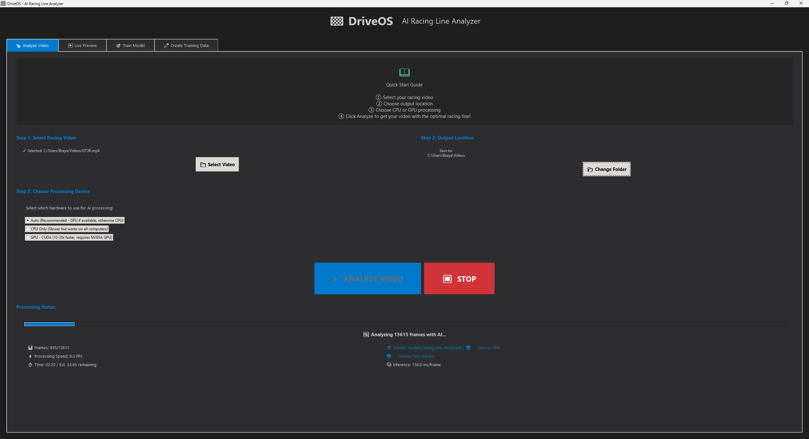
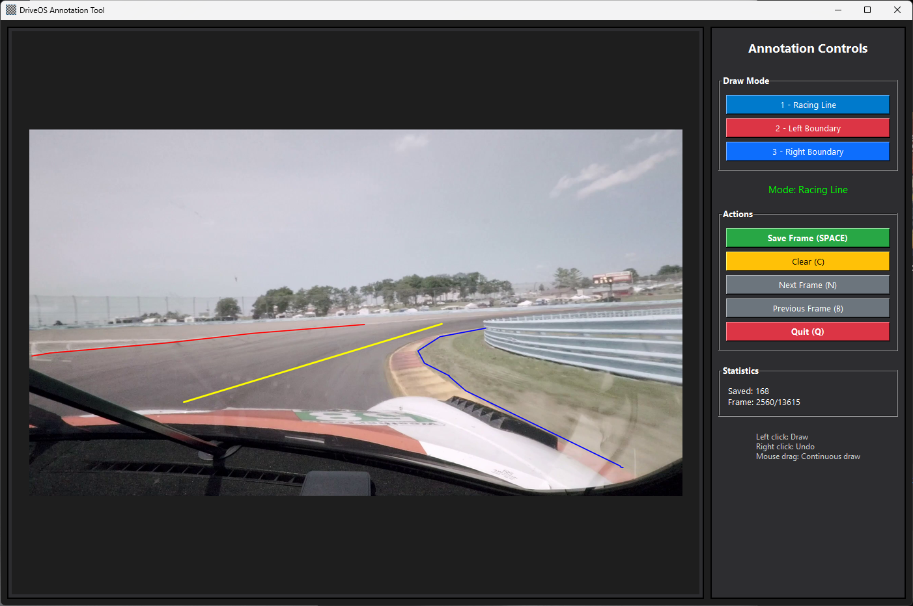
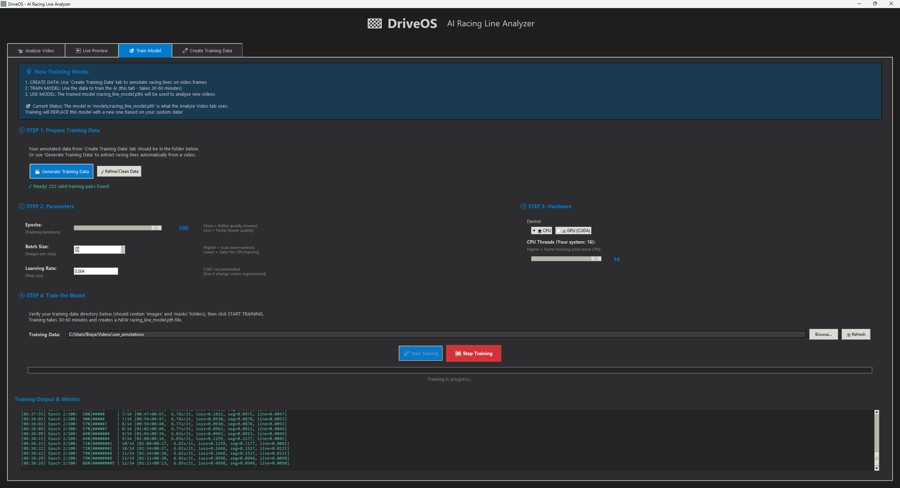

# 🏁 DriveOS - AI Racing Line Analyzer

**AI-powered racing line analysis to find the fastest, most efficient path around any track**

[](https://www.python.org/downloads/)
[](LICENSE)
[](https://www.microsoft.com/windows)

## 🤖 What is DriveOS?

DriveOS is a **machine learning application** that trains neural networks to recognize racing lines in video footage. Unlike rule-based systems that look for specific colors or patterns, DriveOS **learns** what optimal racing lines look like by studying annotated examples.

### How DriveOS Uses Machine Learning

**The Training Process (Why It's ML)**

1. **Data Annotation** - You use the built-in annotation tool to draw racing lines and track boundaries on video frames
   - Yellow lines = optimal racing path through corners
   - Red/blue lines = track boundaries
   - This creates labeled training data (input: raw frame, output: racing line mask)

2. **Neural Network Training** - DriveOS trains a DeepLabV3 model on your annotations
   - The network has **23.8 million learnable parameters** (weights and biases)
   - Uses **supervised learning**: compares its predictions to your annotations
   - Calculates loss (how wrong it is) and adjusts parameters via gradient descent
   - After 20-50 epochs, the network learns patterns: "asphalt looks like this", "racing lines follow these curves"
   - **This is machine learning** - the model discovers features automatically, not programmed

3. **Temporal Understanding** - LSTM networks add sequential awareness
   - Tracks the last 60 frames (~2 seconds) of racing line history
   - Learns motion patterns: how racing lines flow through corner sequences
   - Smooths predictions by understanding context from previous frames

4. **Inference** - The trained model analyzes new footage
   - Processes each frame through the neural network (forward pass)
   - Outputs pixel-wise predictions: probability each pixel is part of the racing line
   - Combines spatial (CNN) and temporal (LSTM) predictions for smooth, continuous lines

**Why This is Machine Learning:**
- **Pattern discovery** - Network finds features (track edges, racing line curvature) automatically from data
- **Generalization** - After training on 50-100 frames, works on thousands of new frames
- **Gradient-based optimization** - Uses backpropagation to minimize prediction error
- **Transfer learning** - Starts with ResNet50 pre-trained on ImageNet (object recognition)
- **Trainable** - Performance improves as you add more annotated examples

## 🚀 Quick Start

1. **Download** this repository (Code → Download ZIP)
2. **Extract** to any location
3. **Double-click `INSTALL.bat`**

The installer automatically handles everything - Python environment, dependencies, GPU detection, and creates a desktop shortcut. Launch DriveOS from your desktop after installation!

### System Requirements

**Minimum:**
- Windows 10+ (64-bit)
- Python 3.9-3.11 ([Download](https://www.python.org/downloads/)) - **Check "Add Python to PATH"**
- 8 GB RAM, 5 GB free space
- Intel Core i5 / AMD Ryzen 5 (4+ cores)

**Recommended:**
- 16 GB RAM, 10 GB free space
- Intel Core i7/i9 or AMD Ryzen 7/9 (8+ cores)
- NVIDIA GPU (GTX 1060 6GB+, RTX 2060+) - 10-20x faster training

## ✨ Features

- **🎥 Multiple Input Sources:**
  - Video files (MP4, AVI, MOV, MKV)
  - Webcam/Camera feed
  - Screen capture (perfect for sim racing!)

- **🤖 AI-Powered Analysis:**
  - Deep learning models (DeepLabV3 + LSTM)
  - Real-time racing line detection
  - Track edge and curb identification
  - Off-track area detection

- **📊 Visual Feedback:**
  - Purple line = Optimal racing line
  - Cyan overlay = Track edges
  - Green zones = Safe racing area
  - Red highlights = Off-track areas

- **🎯 Professional GUI:**
  - Easy-to-use interface
  - Real-time statistics
  - Progress tracking
  - Batch video processing

## 📸 Screenshots

### Analyze Video
Process racing videos and overlay the optimal racing line.



### Live Preview
Real-time racing line analysis from video files, webcams, or screen capture.


### Create Training Data
Interactive annotation tool for creating custom training datasets.



### Train Your Model
Train custom AI models on your own racing footage.



## 🎮 Perfect for Sim Racing

DriveOS supports **screen capture**, making it perfect for analyzing your sim racing sessions in real-time! Works with:
- iRacing
- Assetto Corsa / Assetto Corsa Competizione
- F1 games
- Gran Turismo (via capture card)
- Any racing game or simulator

## 📖 How to Use

### Analyze Video
1. Launch DriveOS → **"Analyze Video"** tab
2. Select your racing video
3. Click **"ANALYZE VIDEO WITH AI"**
4. Get processed video with racing line overlay

### Live Preview
1. **"Live Preview"** tab → Choose source (Video, Webcam, or Screen Capture)
2. Click **"Start Processing"** for real-time analysis

### Create Training Data
1. **"Create Training Data"** tab → Select video → **"Launch Annotation Tool"**
2. Draw racing line (yellow), left boundary (red), right boundary (blue)
3. Press **SPACE** to save frame, **Q** when done
4. Annotate 50-100 diverse frames for best results

### Train Custom Model
1. **"Train Model"** tab → Select training data
2. Adjust parameters (epochs, batch size, learning rate)
3. Click **"Start Training"** (3-5 min GPU, 30-60 min CPU)

## 🛠️ Manual Installation (Developers)

```bash
git clone https://github.com/BrayanVillatoro/DriveOS.git
cd DriveOS
python -m venv .venv
.venv\Scripts\activate

# GPU: pip install torch torchvision --index-url https://download.pytorch.org/whl/cu118
# CPU: pip install torch==2.4.1 torchvision==0.19.1 --index-url https://download.pytorch.org/whl/cpu

pip install -r config/requirements.txt
python launchers/launch_gui.py
```

## 🧠 Technical Details

**Architecture:** DeepLabV3 (ResNet50) + LSTM for vision and temporal analysis

**Performance:**
- **CPU:** 5-10 FPS, ~100-200ms/frame, good for post-analysis
- **GPU:** 30-60 FPS, ~15-30ms/frame, 10-20x faster training

**Processing:** 320x320 model resolution, outputs at input resolution (720p/1080p)


## 📄 License

This project is licensed under the MIT License - see the [LICENSE](LICENSE) file for details.

## ⚠️ Disclaimer

**This is research software.** DriveOS is provided for educational and research purposes. The racing line suggestions are AI-generated and should not be considered as professional racing advice. Always prioritize safety when racing.

## 🐛 Troubleshooting

- **"Python not found":** Install Python 3.9-3.11, check "Add Python to PATH"
- **Installation fails:** Run as Administrator, check internet connection
- **Slow processing:** Close other apps, consider NVIDIA GPU for 10-20x speedup

## 📧 Support & Contributing

- Issues/questions: [GitHub Issues](https://github.com/BrayanVillatoro/DriveOS/issues)
- Contributions welcome via Pull Requests

---

Made with ❤️ for the racing community | **DriveOS** - Drive faster, smarter, better 🏁
